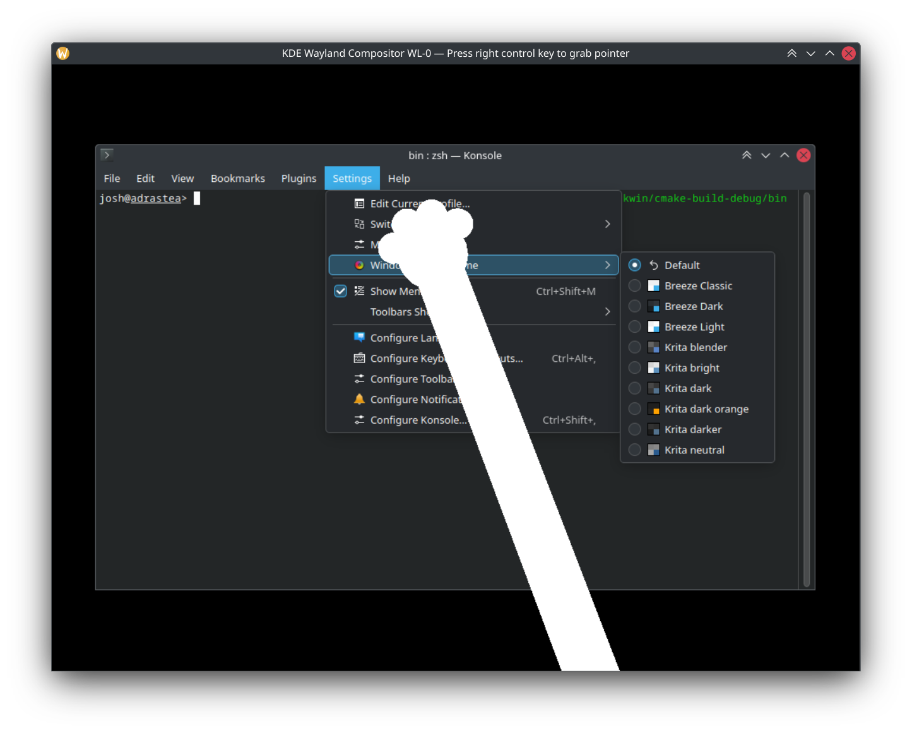

# Cat Paw

A cat paw KWin effect for [KDE Plasma Desktop](https://kde.org/products/plasma-desktop).



## Installation

You need Plasma and KWin development packages installed. Then build:

```sh
git clone https://github.com/redstrate/CatPaw.git
cd CatPaw
mkdir build && cd build
cmake .. \
    -DCMAKE_BUILD_TYPE=Release \
    -DCMAKE_INSTALL_PREFIX=/usr
make
sudo make install
```

You can then enable the cat paw under Desktop Effects. You can also configure the color of the kitty.


## License


This project is licensed under the [GNU General Public License 3](LICENSE).